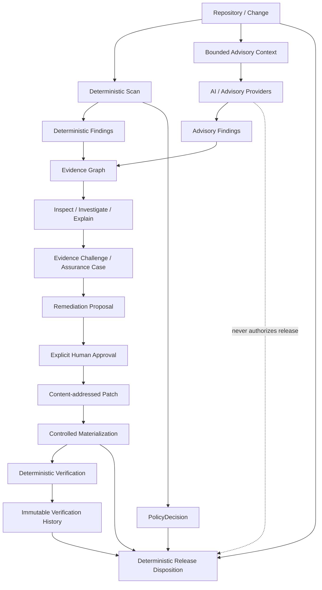

# Preflight

### AI-assisted security review. Deterministic release confidence.

[](https://www.python.org/)
[](LICENSE)
[](docs/RELEASE_DISPOSITION.md)
[](docs/ADVISORY_REVIEW_PLANE.md)

**Preflight** is a security assurance platform for teams shipping AI-generated and AI-assisted software.

It combines AI-powered discovery and investigation with deterministic security controls, evidence lineage, explicit human approval, verification history, and a final release decision that AI cannot override.

> **AI can discover. Humans can approve. Preflight decides from deterministic evidence.**

Preflight is built for one question:

**Are we ready to ship this exact code, with evidence we can inspect and reproduce?**

---

## Install and run

> **CLI note:** The CLI is available as `preflight` (recommended) and `before-deploy` (for backwards compatibility).

### Quickstart (GitHub Actions)

Add Preflight to your CI pipeline:

```yaml
- name: Run Preflight Security Gate
  uses: haytamAroui/preflight@v1
  with:
    policy: 'rules/strict-ci-policy.yaml'
```

### Quickstart (Pre-commit)

Add Preflight to your `.pre-commit-config.yaml`:

```yaml
repos:
  - repo: https://github.com/haytamAroui/preflight
    rev: v1.0.0
    hooks:
      - id: preflight
```

### Local Installation

#### Prerequisites

You need:

- **Python 3.11+**
- **Git**
- **uv** (recommended) or **pip**

#### Clone & Run

```bash
git clone https://github.com/haytamAroui/preflight.git
cd preflight
uv sync --frozen --all-extras
```

Confirm the CLI works:

```bash
uv run preflight --help
# or: uv run before-deploy --help
```

### Run your first scan

```bash
uv run before-deploy scan . \
  --policy rules/default-policy.yaml \
  --output-dir reports/self-scan
```

A completed scan writes evidence such as:

```text
reports/self-scan/report.json
reports/self-scan/report.md
reports/self-scan/report.sarif
```

### Scan another project

From the Preflight repository root:

```bash
TARGET_REPOSITORY="/absolute/path/to/my-project"

uv run before-deploy scan "$TARGET_REPOSITORY" \
  --policy rules/default-policy.yaml \
  --output-dir reports/my-project
```

For all scan options:

```bash
uv run before-deploy scan --help
```

---

## Review before you ship

Preview exactly what will be reviewed before invoking any advisory provider:

```bash
uv run before-deploy review "$TARGET_REPOSITORY" --preview
```

Run a unified review:

```bash
uv run before-deploy review "$TARGET_REPOSITORY" \
  --policy rules/default-policy.yaml \
  --output-dir reports/review
```

Optional OpenCodeReview integration can be enabled explicitly:

```bash
uv run before-deploy review "$TARGET_REPOSITORY" \
  --policy rules/default-policy.yaml \
  --ocr \
  --output-dir reports/review
```

Advisory findings remain **non-authoritative**. Provider failures, model opinions, and AI confidence cannot change the deterministic gate result.

---

## From scan to release evidence

Preflight is more than a scanner. It provides an evidence-preserving assurance workflow:

```text
scan
  ↓
review
  ↓
inspect
  ↓
investigate
  ↓
explain
  ↓
propose
  ↓
approve        ← explicit human action
  ↓
fix            ← scoped, content-addressed patch artifact
  ↓
regress        ← controlled materialization + regression evidence
  ↓
verify
  ↓
history
  ↓
release        ← authoritative READY / HOLD / BLOCK / ERROR
```

Explore each stage:

```bash
uv run before-deploy inspect --help
uv run before-deploy investigate --help
uv run before-deploy explain --help
uv run before-deploy propose --help
uv run before-deploy approve --help
uv run before-deploy fix --help
uv run before-deploy regress --help
uv run before-deploy verify --help
uv run before-deploy history --help
uv run before-deploy release --help
```

The final release command uses persisted deterministic policy evidence, the current verification selected by immutable history, exact materialization evidence, and the current workspace snapshot.

**No LLM participates in the final release decision.**

---

## Why Preflight

AI reviewers are good at exploring code, connecting context, and proposing fixes. They are not a good place to put final release authority.

Preflight separates discovery from authority:

| Plane | What it does | Release authority |
|---|---|---|
| **AI discovery & reasoning** | Review, investigate, explain, challenge evidence, propose remediation | **None** |
| **Human governance** | Approve a specific proposal and confirm exact patch materialization | **Explicit workflow authority, not release authority** |
| **Deterministic assurance** | Scan, validate evidence, verify exact remediation, preserve history | **Deterministic evidence** |
| **Release disposition** | Evaluate policy + current verification + current workspace | **Final authority** |

That separation is the core product promise:

**use powerful AI reasoning without turning probabilistic output into an unreviewable deployment gate.**

---

## What Preflight gives you

| Capability | What you get |
|---|---|
| **Deterministic security gate** | Adaptive repository profiling, bounded controls, policy evaluation, waivers, explicit control health, fail-closed errors, JSON/Markdown/SARIF output |
| **Unified advisory review** | Deterministic findings and optional AI/third-party findings in one review artifact, with advisory findings structurally forced to `gate_effect=NONE` |
| **Deterministic review scope** | Workspace, range, and commit preview with explicit included/excluded files before advisory execution |
| **Provider isolation** | Provider-neutral advisory runtime, deterministic context selection, execution provenance, bounded budgets, retries for transient failures, and failure isolation |
| **Evidence Graph** | Content-addressed lineage connecting repository state, controls, findings, policy, advisory context, provider execution, artifacts, and claims |
| **Correlation & corroboration** | Deterministic location correlation, exact advisory deduplication, repeated-claim provenance, and diagnostic corroboration without confidence inflation |
| **Inspect / investigate / explain** | Persisted evidence inspection, bounded investigation context, and citation-required advisory explanations |
| **Evidence Challenge** | Structured `SUPPORTED`, `INSUFFICIENT`, `CONTRADICTED`, and `UNRESOLVED` outcomes over bounded evidence |
| **Assurance cases** | Traceable advisory assurance graphs preserving initial vs expanded evidence and challenge relationships |
| **Human-approved remediation** | Evidence-cited proposals, exact proposal approval, content-addressed patches, controlled materialization, and regression evidence |
| **Deterministic verification** | Verification of the exact approved remediation against declared verification goals |
| **Immutable verification history** | Linear verification history with explicit supersession instead of “best result wins” |
| **Release disposition** | Final `READY`, `HOLD`, `BLOCK`, or `ERROR` from deterministic policy evidence, current verification, exact materialization, and current workspace |
| **Benchmarks** | Labeled review benchmark, static-vs-exploratory comparison, caller-context experiments, repeated-run stability, latency/token/cost provenance, and production-readiness diagnostics |
| **Developer integrations** | CLI, Python platform API, bounded MCP server, Claude Code client, and repo-scoped Codex skill |

---

## The architecture



**AI output never becomes release authority.**

See [`docs/RELEASE_DISPOSITION.md`](docs/RELEASE_DISPOSITION.md) and [`docs/ADVISORY_REVIEW_PLANE.md`](docs/ADVISORY_REVIEW_PLANE.md).

---

## Security coverage

Preflight maintains a versioned capability registry and security-domain catalog with bounded controls and explicit scope.

Current coverage includes controls and/or profiles across:

- **Python / FastAPI** — authentication/authorization markers, SSRF patterns, SQL injection shapes, command injection, JWT verification bypass, uploads/file handling, input validation, CORS, session security, data integrity, sensitive logging, dependency and release evidence
- **JavaScript / TypeScript / Next.js** — SSRF, Server Actions, public environment exposure, session/CORS patterns, route error disclosure, dependency/release evidence
- **Java / Spring** — Spring Security permit-all, Actuator exposure, credentialed wildcard CORS, JPA native-query injection
- **Go** — TLS misuse, module evidence, bounded offline vulnerability snapshot checks, optional Gosec adapter
- **PHP / Laravel**, **Rust / Cargo**, **Ruby / Rails** — bounded lockfile/dependency evidence profiles
- **Docker / Terraform** — staged Trivy configuration evidence
- **Docker Compose** — bounded privileged-service detection
- **GitHub Actions / supply chain** — workflow hardening, lockfiles, SBOM/provenance/release-evidence controls

External scanners remain isolated adapters with bounded execution and normalized output. A configured required scanner that fails becomes an explicit error — never a silent pass.

See [`docs/CONTROL_CATALOG.md`](docs/CONTROL_CATALOG.md), [`docs/SECURITY_DOMAIN_CONTROL_CATALOG.md`](docs/SECURITY_DOMAIN_CONTROL_CATALOG.md), and [`docs/ADAPTIVE_PROJECT_PROFILING.md`](docs/ADAPTIVE_PROJECT_PROFILING.md).

---

## Outcomes you can automate

### Deterministic policy

| Outcome | Exit code | Meaning |
|---|---:|---|
| `PASS` | `0` | Applicable configured controls completed without an unwaived blocking result |
| `NOT_EVALUATED` | `0` | No configured control established a pass for the selected scope |
| `BLOCK` | `10` | A policy-blocking finding remains |
| `WAIVER_REQUIRED` | `11` | Policy requires an explicit valid waiver |
| `ERROR` | `20` | Required evidence, tool execution, or input validation failed |

### Final release disposition

| Status | Meaning |
|---|---|
| `READY` | Declared deterministic release requirements are satisfied for the current workspace |
| `HOLD` | Release evidence is incomplete, stale, drifted, waived, or below configured trust requirements |
| `BLOCK` | Deterministic policy or current verification blocks release |
| `ERROR` | Authoritative release evaluation failed |

`READY` is intentionally bounded. It does not claim the application is vulnerability-free.

---

## Evidence you can inspect

Depending on the workflow, Preflight emits artifacts such as:

```text
report.json / report.md / report.sarif
review.json / review.md
review-session.json
review-delta.json / review-delta.md
inspection.json
investigation-request.json / investigation.json
explanation-request.json / explanation.json
remediation-proposal.json
human-approval.json
patch.json
patch-materialization.json
regression-evidence.json
verification.json
verification-history.json
release-disposition.json
```

Artifacts are designed around bounded content, hashes, lineage, authority metadata, and explicit limitations rather than hidden model reasoning or hidden release logic.

---

## MCP, Claude Code, and Codex

### MCP

Run the bounded stdio MCP server:

```bash
uv run before-deploy-mcp
```

It exposes diagnostic, verification, and release surfaces while deliberately not exposing human approval, patch generation, or workspace materialization as autonomous tools.

See [`docs/MCP_API_SURFACE.md`](docs/MCP_API_SURFACE.md).

### Claude Code

The repository includes a thin Claude Code client that delegates to the canonical CLI instead of reimplementing policy or release logic.

See [`clients/claude-code/README.md`](clients/claude-code/README.md).

### Codex

The repository includes a repo-scoped explicit-use Codex skill under `.agents/skills/before-deploy-assure/` with the same authority boundaries.

See [`docs/CODEX_THIN_CLIENT.md`](docs/CODEX_THIN_CLIENT.md).

---

## Benchmarked instead of hand-waved

Preflight includes a diagnostic benchmark plane for measuring advisory review quality without turning benchmark scores into release authority.

The benchmark stack includes:

- versioned labeled-defect corpora;
- deterministic precision/recall/F1 scoring;
- static-vs-exploratory comparative runs;
- blinded caller-context pilot corpora;
- repeated-run stability metrics;
- latency, context, token, and cost provenance;
- a repeated GPT-5.6 Luna production-readiness workflow;
- bounded transient retry handling and optional cumulative token/cost budgets;
- frozen production-readiness criteria and a deterministic engineering-readiness evaluator.

**Benchmark and readiness outputs remain diagnostic. They cannot grant an application release.**

See [`docs/REVIEW_BENCHMARK.md`](docs/REVIEW_BENCHMARK.md), [`docs/CALLER_PILOT_V2.md`](docs/CALLER_PILOT_V2.md), [`docs/PROVIDER_RESILIENCE.md`](docs/PROVIDER_RESILIENCE.md), and [`docs/PRODUCTION_READINESS_CRITERIA.md`](docs/PRODUCTION_READINESS_CRITERIA.md).

---

## What Preflight is not

Preflight is not a penetration-test replacement, a compliance certification, or proof that no vulnerability exists.

It does not let an LLM:

- rewrite deterministic policy;
- invent a waiver;
- upgrade an advisory claim into a deterministic finding;
- silently approve its own remediation;
- materialize a patch without explicit confirmation;
- fabricate regression evidence;
- select an older “better” verification over the current one;
- declare a release `READY` from model judgment.

Those boundaries are product features.

---

## Documentation

| Topic | Documentation |
|---|---|
| Deterministic controls & adaptive planning | [`CONTROL_CATALOG.md`](docs/CONTROL_CATALOG.md), [`ADAPTIVE_PROJECT_PROFILING.md`](docs/ADAPTIVE_PROJECT_PROFILING.md) |
| Security-domain model | [`SECURITY_DOMAIN_CONTROL_CATALOG.md`](docs/SECURITY_DOMAIN_CONTROL_CATALOG.md), [`DOMAIN_ASSURANCE.md`](docs/DOMAIN_ASSURANCE.md) |
| Unified AI review | [`ADVISORY_REVIEW_PLANE.md`](docs/ADVISORY_REVIEW_PLANE.md), [`ADVISORY_PROVIDER_RUNTIME.md`](docs/ADVISORY_PROVIDER_RUNTIME.md) |
| Evidence lineage | [`EVIDENCE_GRAPH.md`](docs/EVIDENCE_GRAPH.md), [`EVIDENCE_CORRELATION.md`](docs/EVIDENCE_CORRELATION.md), [`EVIDENCE_CORROBORATION.md`](docs/EVIDENCE_CORROBORATION.md) |
| Investigation & explanation | [`EVIDENCE_INSPECT.md`](docs/EVIDENCE_INSPECT.md), [`EVIDENCE_INVESTIGATION.md`](docs/EVIDENCE_INVESTIGATION.md), [`EVIDENCE_EXPLANATION.md`](docs/EVIDENCE_EXPLANATION.md) |
| Challenge & assurance | [`EVIDENCE_CHALLENGE.md`](docs/EVIDENCE_CHALLENGE.md), [`ASSURANCE_CASE.md`](docs/ASSURANCE_CASE.md) |
| Remediation & verification | [`REMEDIATION_PROPOSAL.md`](docs/REMEDIATION_PROPOSAL.md), [`HUMAN_APPROVAL_PATCH.md`](docs/HUMAN_APPROVAL_PATCH.md), [`VERIFICATION.md`](docs/VERIFICATION.md) |
| Release authority | [`VERIFICATION_HISTORY.md`](docs/VERIFICATION_HISTORY.md), [`RELEASE_DISPOSITION.md`](docs/RELEASE_DISPOSITION.md) |
| Benchmarking | [`REVIEW_BENCHMARK.md`](docs/REVIEW_BENCHMARK.md), [`CALLER_PILOT_V2.md`](docs/CALLER_PILOT_V2.md), [`PRODUCTION_READINESS_CRITERIA.md`](docs/PRODUCTION_READINESS_CRITERIA.md) |
| Integrations | [`MCP_API_SURFACE.md`](docs/MCP_API_SURFACE.md), [`CLAUDE_THIN_CLIENT.md`](docs/CLAUDE_THIN_CLIENT.md), [`CODEX_THIN_CLIENT.md`](docs/CODEX_THIN_CLIENT.md) |

---

## Project status

Preflight is actively developed. The deterministic authority boundary is the architectural constant: advisory engines, benchmarks, integrations, and control depth can evolve without changing who is allowed to decide a release.

The production-readiness framework intentionally distinguishes **implemented capability** from **proven operational maturity**. See [`docs/PRODUCTION_READINESS_CRITERIA.md`](docs/PRODUCTION_READINESS_CRITERIA.md).

---

## License

MIT — see [`LICENSE`](LICENSE).
