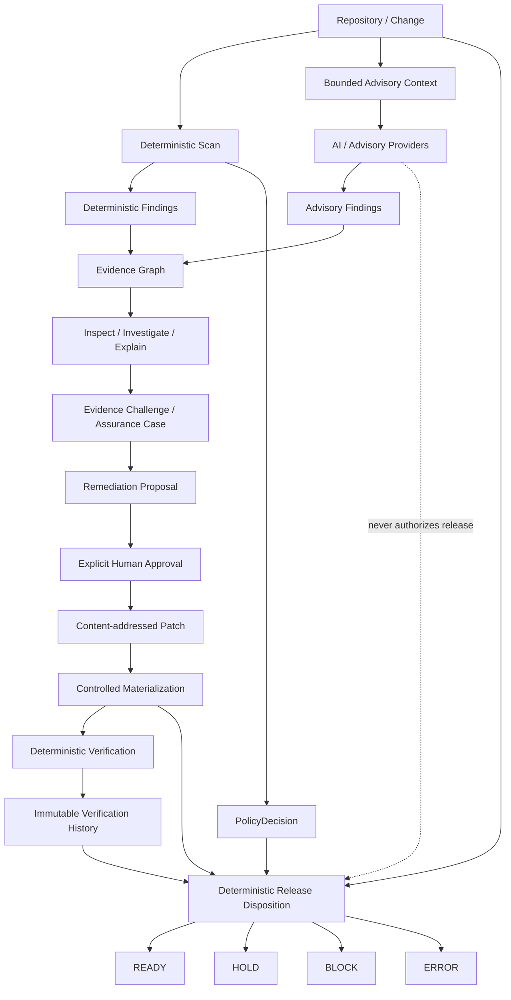

# Before Deploy

### Security confidence for AI-built software — without giving AI the release key.

[](https://www.python.org/)
[](LICENSE)
[](docs/RELEASE_DISPOSITION.md)
[](docs/ADVISORY_REVIEW_PLANE.md)

**Before Deploy** combines broad AI-assisted code review with deterministic security controls, evidence lineage, explicit human approval, verification history, and a final release decision that AI cannot override.

> **AI can discover. Humans can approve. Only deterministic evidence can release.**

Before Deploy is designed for teams shipping quickly with AI-generated or AI-assisted code who still want a review and release process they can inspect, reproduce, and trust.

---

## Why Before Deploy

Modern AI reviewers are good at exploring code, connecting context, and proposing fixes. They are not a good place to put final release authority.

Before Deploy separates those responsibilities on purpose:

| Plane | What it does | Release authority |
|---|---|---|
| **AI discovery & reasoning** | Review, investigate, explain, challenge evidence, propose remediation | **None** |
| **Human governance** | Approve a specific proposal and confirm exact patch materialization | **Explicit workflow authority, not release authority** |
| **Deterministic assurance** | Scan, validate evidence, verify exact remediation, preserve history | **Deterministic evidence** |
| **Release disposition** | Evaluate policy + current verification + current workspace | **Final authority** |

The result is a security workflow that can use powerful AI reasoning without turning probabilistic output into an unreviewable deployment gate.

---

## What Before Deploy does today

Before Deploy has grown from a deterministic scanner into a full assurance platform.

| Capability | What you get |
|---|---|
| **Deterministic security gate** | Adaptive repository profiling, bounded controls, policy evaluation, waivers, explicit control health, fail-closed errors, JSON/Markdown/SARIF output |
| **Unified advisory review** | Deterministic findings and optional AI/third-party findings in one review artifact, with advisory findings structurally forced to `gate_effect=NONE` |
| **Deterministic review scope** | Workspace, range, and commit preview with explicit included/excluded files before advisory execution |
| **Provider isolation** | Provider-neutral advisory runtime, deterministic context selection, execution provenance, output normalization, bounded budgets, and failure isolation |
| **Evidence Graph** | Content-addressed lineage connecting repository state, controls, findings, policy, advisory context, provider execution, raw/normalized artifacts, and claims |
| **Correlation & corroboration** | Deterministic location correlation, exact advisory deduplication, repeated-claim provenance, and diagnostic corroboration without confidence inflation |
| **Inspect / investigate / explain** | Persisted evidence inspection, bounded investigation context, and citation-required advisory explanations |
| **Evidence Challenge** | Structured `SUPPORTED`, `INSUFFICIENT`, `CONTRADICTED`, and `UNRESOLVED` challenge outcomes over bounded evidence |
| **Assurance cases** | Traceable advisory assurance graphs that preserve initial vs expanded evidence and challenge relationships |
| **Remediation workflow** | Evidence-cited proposals, explicit human approval, content-addressed patch artifacts, controlled patch materialization, and regression evidence |
| **Verification** | Deterministic verification of exact approved remediation against declared verification goals |
| **Immutable history** | Linear verification history with explicit supersession instead of “best result wins” |
| **Release disposition** | Final `READY`, `HOLD`, `BLOCK`, or `ERROR` from deterministic policy evidence, current verification, exact materialization, and current workspace state |
| **Benchmarks** | Labeled review benchmark, comparative static-vs-exploratory evaluation, caller-context experiments, repeated-run stability, latency/token/cost provenance |
| **Developer integrations** | CLI, Python platform API, bounded MCP server, Claude Code client, and repo-scoped Codex skill |

---

## The core architecture



### One invariant matters more than every feature above

**AI output never becomes release authority.**

Advisory providers can find a serious issue, explain it brilliantly, correlate with deterministic evidence, survive repeated runs, and receive a `SUPPORTED` challenge result — and the finding is still advisory.

Only the deterministic release path can emit final release disposition.

See [`docs/RELEASE_DISPOSITION.md`](docs/RELEASE_DISPOSITION.md) and [`docs/ADVISORY_REVIEW_PLANE.md`](docs/ADVISORY_REVIEW_PLANE.md).

---

## From “scan my code” to “prove this release”

Before Deploy exposes a staged workflow instead of one opaque AI verdict.

```text
scan
  ↓
review
  ↓
inspect
  ↓
investigate
  ↓
explain
  ↓
propose
  ↓
approve        ← explicit human action
  ↓
fix            ← generates a scoped patch artifact
  ↓
regress        ← controlled materialization + regression evidence
  ↓
verify
  ↓
history
  ↓
release        ← only authoritative READY / HOLD / BLOCK / ERROR
```

Each stage carries forward validated provenance and content-addressed identities so later stages cannot silently detach from the evidence that justified them.

---

## Deterministic security coverage

Before Deploy maintains a versioned capability registry and security-domain catalog. The catalog maps the project’s **21 foundational security domains** to real control contracts, while keeping depth and technology scope explicit rather than pretending every stack is equally covered.

Current bounded coverage includes controls and/or profiles across:

- **Python / FastAPI** — authentication/authorization markers, SSRF patterns, SQL injection shapes, command injection, JWT verification bypass, upload/file handling, input validation, CORS, session security, data integrity, sensitive logging, dependency and release evidence
- **JavaScript / TypeScript / Next.js** — SSRF, Server Actions, public environment exposure, session/CORS patterns, route error disclosure, dependency/release evidence
- **Java / Spring** — Spring Security permit-all, Actuator exposure, credentialed wildcard CORS, JPA native-query injection
- **Go** — TLS misuse, lockfile/module evidence, bounded offline vulnerability snapshot checks, optional Gosec adapter
- **PHP / Laravel**, **Rust / Cargo**, **Ruby / Rails** — bounded lockfile/dependency evidence profiles
- **Docker / Terraform** — staged Trivy configuration evidence
- **Docker Compose** — bounded privileged-service detection
- **GitHub Actions / supply chain** — workflow hardening, lockfiles, SBOM/provenance/release-evidence controls

External scanners remain isolated adapters with bounded execution and normalized output. A configured required scanner that fails becomes an explicit error — never a silent pass.

Deep control documentation lives in [`docs/CONTROL_CATALOG.md`](docs/CONTROL_CATALOG.md), [`docs/SECURITY_DOMAIN_CONTROL_CATALOG.md`](docs/SECURITY_DOMAIN_CONTROL_CATALOG.md), and [`docs/ADAPTIVE_PROJECT_PROFILING.md`](docs/ADAPTIVE_PROJECT_PROFILING.md).

---

## AI review without AI authority

The advisory plane is built for useful AI, not ceremonial AI.

It supports:

- deterministic changed-file preview before model execution;
- reproducible bounded context with per-file hashes and aggregate byte budgets;
- provider execution provenance and normalized output digests;
- isolated OpenCodeReview-compatible review;
- persistent review sessions with `NEW`, `PERSISTING`, and `ABSENT_CURRENT` lifecycle states;
- bounded cross-file exploration experiments such as `find_callers`;
- evidence dependency tracking so expanded-context claims must actually cite expanded evidence;
- challenge and assurance-case layers that preserve disagreement instead of hiding it.

Even provider errors stay gate-neutral. The deterministic policy result remains unchanged.

Read more:

- [`docs/ADVISORY_PROVIDER_RUNTIME.md`](docs/ADVISORY_PROVIDER_RUNTIME.md)
- [`docs/ADVISORY_CONTEXT.md`](docs/ADVISORY_CONTEXT.md)
- [`docs/ADVISORY_EXECUTION_PROVENANCE.md`](docs/ADVISORY_EXECUTION_PROVENANCE.md)
- [`docs/EVIDENCE_GRAPH.md`](docs/EVIDENCE_GRAPH.md)
- [`docs/REVIEW_SESSIONS.md`](docs/REVIEW_SESSIONS.md)

---

## Human-approved remediation, exact-byte verification

Before Deploy does not turn an AI suggestion into a repository mutation by implication.

The remediation path deliberately adds friction at the trust boundaries:

1. AI may produce an **evidence-cited, non-executable remediation proposal**.
2. A human must explicitly approve the exact `proposal_sha256`.
3. The generated patch receives its own `patch_sha256` and remains `UNREVIEWED` / `NOT_APPLIED`.
4. Materialization requires explicit confirmation of that exact patch digest and declared operator identity.
5. Before Deploy verifies base hashes, target scope, symlink constraints, patch application, and post-write hashes.
6. Regression evidence is bound to the exact materialization.
7. Deterministic verification evaluates the exact remediation lineage.
8. Verification history records explicit supersession.
9. Release disposition checks the current workspace again before `READY` is possible.

That means a stale scan, changed workspace, mismatched patch, newer failed verification, or policy block cannot be papered over by an AI summary.

See [`docs/HUMAN_APPROVAL_PATCH.md`](docs/HUMAN_APPROVAL_PATCH.md), [`docs/REGRESSION_EVIDENCE.md`](docs/REGRESSION_EVIDENCE.md), [`docs/VERIFICATION.md`](docs/VERIFICATION.md), and [`docs/VERIFICATION_HISTORY.md`](docs/VERIFICATION_HISTORY.md).

---

## Benchmarked instead of hand-waved

Before Deploy includes a diagnostic benchmark plane for evaluating advisory review quality without turning benchmark scores into release authority.

The current benchmark stack includes:

- versioned labeled-defect corpora;
- deterministic TP / FP / FN / precision / recall / F1 scoring;
- exact one-to-one matching rules;
- repeated-run stability metrics;
- context bytes, tool calls, latency, token usage, and cost provenance;
- static-vs-exploratory comparative runs;
- blinded caller-context pilot corpora;
- a repeated GPT-5.6 Luna production-readiness workflow;
- bounded retry handling, stable request IDs, and optional cumulative token/cost budgets for the production benchmark bridge;
- a frozen engineering-readiness criteria document and deterministic readiness evaluator.

**Benchmark and readiness outputs are diagnostic.** They do not grant an application release.

See [`docs/REVIEW_BENCHMARK.md`](docs/REVIEW_BENCHMARK.md), [`docs/CALLER_PILOT_V2.md`](docs/CALLER_PILOT_V2.md), [`docs/PROVIDER_RESILIENCE.md`](docs/PROVIDER_RESILIENCE.md), and [`docs/PRODUCTION_READINESS_CRITERIA.md`](docs/PRODUCTION_READINESS_CRITERIA.md).

---

## Works with the tools developers already use

### CLI

The canonical interface is the `before-deploy` CLI.

```bash
uv run before-deploy --help
```

### MCP

A bounded stdio MCP server exposes read/diagnostic/verification/release surfaces while deliberately **not** exposing human approval, patch generation, or workspace materialization tools.

```bash
uv run before-deploy-mcp
```

See [`docs/MCP_API_SURFACE.md`](docs/MCP_API_SURFACE.md).

### Claude Code

The repository includes a thin Claude Code client that delegates to the canonical CLI instead of reimplementing policy or release logic.

See [`clients/claude-code/README.md`](clients/claude-code/README.md).

### Codex

The repository includes a repo-scoped explicit-use Codex skill under `.agents/skills/before-deploy-assure/` with the same trust boundaries.

See [`docs/CODEX_THIN_CLIENT.md`](docs/CODEX_THIN_CLIENT.md).

---

## Quick start

### Prerequisites

- Python **3.11+**
- [uv](https://docs.astral.sh/uv/)
- Git recommended

### Install the locked development environment

```bash
git clone https://github.com/haytamAroui/befor-deploy-for-vibe-coder.git
cd befor-deploy-for-vibe-coder
uv sync --frozen --all-extras
```

### Run the deterministic gate

```bash
uv run before-deploy scan . \
  --policy rules/default-policy.yaml \
  --output-dir reports/self-scan
```

### Preview advisory review scope without sending code to a model

```bash
uv run before-deploy review . --preview
```

### Run a unified review

```bash
uv run before-deploy review . \
  --policy rules/default-policy.yaml \
  --output-dir reports/review
```

Optional advisory providers/files can be added to the review path while the deterministic `PolicyDecision` remains the source of gate status.

### Explore the assurance workflow

```bash
uv run before-deploy inspect --help
uv run before-deploy investigate --help
uv run before-deploy explain --help
uv run before-deploy propose --help
uv run before-deploy approve --help
uv run before-deploy fix --help
uv run before-deploy regress --help
uv run before-deploy verify --help
uv run before-deploy history --help
uv run before-deploy release --help
```

---

## Outcomes you can automate

### Deterministic policy

| Status | Meaning |
|---|---|
| `PASS` | Declared deterministic policy passed for the evaluated scope |
| `BLOCK` | A policy-blocking finding remains |
| `WAIVER_REQUIRED` | Policy requires an explicit valid waiver |
| `NOT_EVALUATED` | No configured control established a pass for the selected scope |
| `ERROR` | Required evidence, tool execution, or input validation failed |

### Final release disposition

| Status | Meaning |
|---|---|
| `READY` | Declared deterministic policy, current verification, materialization, trust requirements, and current workspace snapshot satisfy release requirements |
| `HOLD` | Release evidence is incomplete, stale, drifted, waived, or below configured trust requirements |
| `BLOCK` | Deterministic policy or current verification blocks release |
| `ERROR` | Authoritative release evaluation failed |

`READY` is intentionally bounded. It means the declared Before Deploy requirements are satisfied for the current workspace — not that the software is guaranteed vulnerability-free.

---

## Evidence you can inspect

Depending on the workflow, Before Deploy emits artifacts such as:

```text
report.json / report.md / report.sarif
review.json / review.md
review-session.json
review-delta.json / review-delta.md
inspection.json
investigation-request.json / investigation.json
explanation-request.json / explanation.json
remediation-proposal.json
human-approval.json
patch.json
patch-materialization.json
regression-evidence.json
verification.json
verification-history.json
release-disposition.json
```

Artifacts are designed around bounded content, hashes, lineage, authority metadata, and explicit limitations rather than raw model reasoning or hidden release logic.

---

## What Before Deploy is not

Before Deploy is not a penetration-test replacement, a compliance certification, or a proof that no vulnerability exists.

It also does not let an LLM:

- rewrite deterministic policy;
- invent a waiver;
- upgrade an advisory claim into a deterministic finding;
- silently approve its own remediation;
- materialize a patch without explicit confirmation;
- fabricate regression evidence;
- select an older “better” verification over the current one;
- declare a release `READY` from model judgment.

Those boundaries are product features, not limitations to work around.

---

## Documentation map

| Topic | Documentation |
|---|---|
| Deterministic controls & adaptive planning | [`CONTROL_CATALOG.md`](docs/CONTROL_CATALOG.md), [`ADAPTIVE_PROJECT_PROFILING.md`](docs/ADAPTIVE_PROJECT_PROFILING.md) |
| Security-domain model | [`SECURITY_DOMAIN_CONTROL_CATALOG.md`](docs/SECURITY_DOMAIN_CONTROL_CATALOG.md), [`DOMAIN_ASSURANCE.md`](docs/DOMAIN_ASSURANCE.md) |
| Unified AI review | [`ADVISORY_REVIEW_PLANE.md`](docs/ADVISORY_REVIEW_PLANE.md), [`ADVISORY_PROVIDER_RUNTIME.md`](docs/ADVISORY_PROVIDER_RUNTIME.md) |
| Evidence lineage | [`EVIDENCE_GRAPH.md`](docs/EVIDENCE_GRAPH.md), [`EVIDENCE_CORRELATION.md`](docs/EVIDENCE_CORRELATION.md), [`EVIDENCE_CORROBORATION.md`](docs/EVIDENCE_CORROBORATION.md) |
| Investigation & explanation | [`EVIDENCE_INSPECT.md`](docs/EVIDENCE_INSPECT.md), [`EVIDENCE_INVESTIGATION.md`](docs/EVIDENCE_INVESTIGATION.md), [`EVIDENCE_EXPLANATION.md`](docs/EVIDENCE_EXPLANATION.md) |
| Challenge & assurance | [`EVIDENCE_CHALLENGE.md`](docs/EVIDENCE_CHALLENGE.md), [`ASSURANCE_CASE.md`](docs/ASSURANCE_CASE.md) |
| Remediation & verification | [`REMEDIATION_PROPOSAL.md`](docs/REMEDIATION_PROPOSAL.md), [`HUMAN_APPROVAL_PATCH.md`](docs/HUMAN_APPROVAL_PATCH.md), [`VERIFICATION.md`](docs/VERIFICATION.md) |
| Release authority | [`VERIFICATION_HISTORY.md`](docs/VERIFICATION_HISTORY.md), [`RELEASE_DISPOSITION.md`](docs/RELEASE_DISPOSITION.md) |
| Benchmarking | [`REVIEW_BENCHMARK.md`](docs/REVIEW_BENCHMARK.md), [`CALLER_PILOT_V2.md`](docs/CALLER_PILOT_V2.md), [`PRODUCTION_READINESS_CRITERIA.md`](docs/PRODUCTION_READINESS_CRITERIA.md) |
| Integrations | [`MCP_API_SURFACE.md`](docs/MCP_API_SURFACE.md), [`CLAUDE_THIN_CLIENT.md`](docs/CLAUDE_THIN_CLIENT.md), [`CODEX_THIN_CLIENT.md`](docs/CODEX_THIN_CLIENT.md) |

---

## Project status

Before Deploy is actively developed. The deterministic authority boundary is the architectural constant; advisory engines, benchmarks, integrations, and control depth can evolve without changing who is allowed to decide a release.

The production-readiness framework intentionally distinguishes **implemented capability** from **proven operational maturity**. See [`docs/PRODUCTION_READINESS_CRITERIA.md`](docs/PRODUCTION_READINESS_CRITERIA.md) for the current evidence requirements.

---

## License

MIT — see [`LICENSE`](LICENSE).
