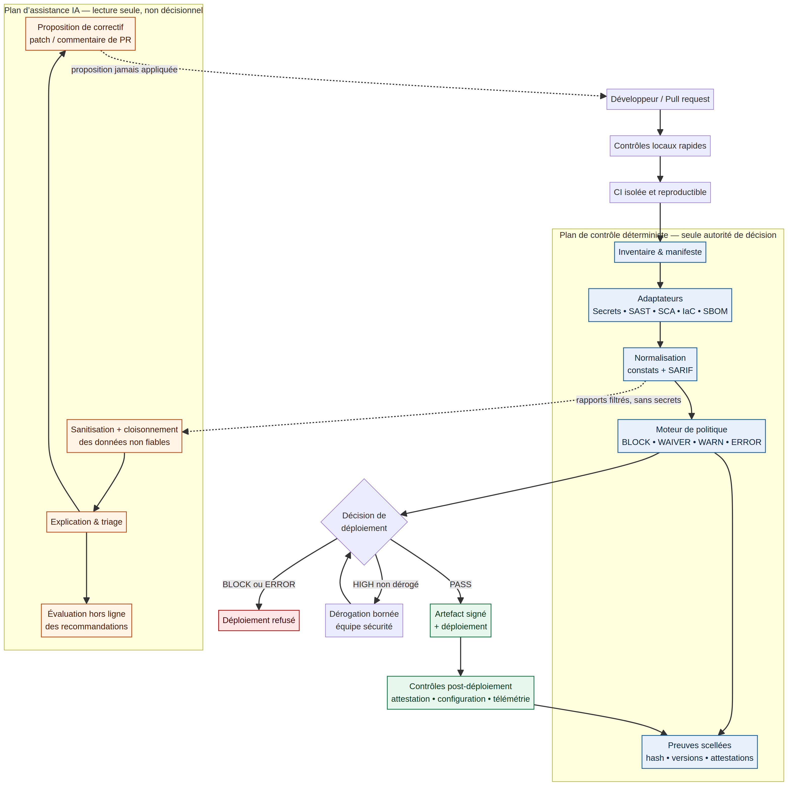

# Sentinel — Deep Analysis and Build Blueprint

**Prepared by:** Manus AI  
**Date:** 27 August 2026  
**Basis of analysis:** the three supplied project documents, supplemented by current primary technical and regulatory sources.

> **Decision:** Build Sentinel as a **deterministic pre-deployment security-control platform with an optional, read-only AI assistance plane**. Do not build it as an “AI security agent,” a compliance-certification engine, or a set of 21 bespoke string-match validators.

## Executive conclusion

The project has a strong core idea: security enforcement must remain deterministic, reproducible, attributable, and independent of an LLM. The supplied materials progressively improve the concept from a broad “21-validator framework” into a more credible hybrid model, where code and configuration checks enforce policy while AI explains findings and proposes remediation. That direction is correct.

However, the project should be repositioned before implementation. The product cannot credibly guarantee “100% NIST SSDF coverage,” “full EU CRA compliance,” SOC 2 Type II status, a fixed false-negative rate, cyber-insurance outcomes, or executive liability outcomes. NIST describes SSDF as a set of high-level practices to integrate into a software-development lifecycle, not a certification a scanner can attain.[3] Likewise, the CRA requires manufacturer-level risk assessment, technical documentation, support-period management, vulnerability handling, and conformity processes; a scan can generate useful engineering evidence but cannot perform these organizational duties by itself.[1]

| Strategic question | Recommended answer |
|---|---|
| **What is Sentinel?** | A policy-driven security control plane that orchestrates established scanners, normalizes findings, applies versioned release policy, creates evidence bundles, and optionally offers AI-assisted triage and patch proposals. |
| **Who makes the release decision?** | The deterministic policy engine only. An AI model has no authority to approve, waive, change rules, modify deployment settings, or execute commands. |
| **What should be launched first?** | A narrow FastAPI + Next.js + GitHub Actions MVP, not a generic all-language platform and not a dashboard-first SaaS. |
| **What is the durable differentiator?** | Transparent policy, trustworthy evidence, carefully scoped framework-aware controls, a bounded waiver process, and an excellent developer remediation experience—not reimplementing mature scanners. |
| **What must never be claimed?** | Compliance certification, pentest coverage, exhaustive vulnerability detection, audit sufficiency, or quantitative accuracy without a published benchmark and validation protocol. |

The best implementation model is therefore a **small deterministic kernel**, a portfolio of external-tool adapters, and three tightly controlled AI capabilities: explanation, remediation proposal, and offline evaluation. All other “agents” should be treated as deterministic executors or services. This distinction is not cosmetic; it sharply reduces the attack surface and produces results that can be repeated with the same repository revision, ruleset, tool versions, and policy.

## 1. What the supplied material gets right—and what must change

The first document defines a broad pre-deployment framework with 21 thematic validators. The second document correctly argues that an LLM should not be the final gatekeeper and proposes a layered local, CI/CD, and advisory model. The third document performs the most important correction: it rejects a fake compliance percentage, removes unsafe auto-approval after several high-severity findings, and distinguishes blocking checks from advisory review. Sentinel should preserve these corrections.

| Supplied position | Assessment | Position for the product specification |
|---|---|---|
| A standalone CLI is the source of truth. | **Correct.** A gate must reproduce its result from known inputs. | Retain. The CLI and policy engine remain the deployment authority. |
| AI assists developers with explanation and fixes. | **Correct, with controls.** AI is useful for contextual remediation but must be treated as untrusted advisory computation. | Retain only in read-only and proposal-only modes. |
| The product has exactly 21 validators. | **Too rigid.** Categories are useful, but rules should evolve independently and be versioned. | Replace the number with a control catalog: stable control families, versioned rules, and explicit applicability. |
| All HIGH findings require a waiver. | **Substantially safer** than auto-approval, but still needs confidence, scope, expiry, and evidence rules. | Retain with a signed, time-bounded waiver linked to exact finding fingerprints and artifact version. |
| A configuration object proves runtime posture. | **Incorrect.** A user-supplied YAML or Python dictionary can be stale, incomplete, or misleading. | Collect evidence from repository, lockfiles, deployment manifests, CI context, and—where available—cloud or runtime APIs. Mark unavailable evidence as `NOT_EVALUATED`, never as pass. |
| A validator exception is a HIGH finding. | **Unsafe.** Tool failure could be silently allowed if the count stays below a threshold. | Use `ERROR` / `INDETERMINATE`; protected-branch and release policy must fail closed unless an emergency process is explicitly invoked. |
| SARIF is the reporting standard. | **Correct.** SARIF is an OASIS standard for static-analysis results interchange.[6] | Emit valid SARIF 2.1.0 plus Sentinel JSON and a human-readable release summary. |
| SBOM and provenance matter. | **Correct.** They support inventory and traceability but do not prove the artifact is secure. | Generate CycloneDX SBOMs and verify signed provenance on release artifacts. CycloneDX supports component and dependency inventory; SLSA distinguishes increasing provenance and build-hardening guarantees.[7] [8] |
| Claims of fixed detection rates, costs, and breach outcomes. | **Unsupported and misleading.** No benchmark, sample method, or confidence interval was supplied. | Remove. Publish measured, versioned evaluation results only after a representative test corpus exists. |
| “EU compliance checks” are equivalent to compliance. | **Incorrect.** Applicability and duties vary by product, role, jurisdiction, and process maturity. | Name these checks “evidence-supporting controls” and clearly document their limits. |

The product’s original software design is also incomplete. It passes a `codebase: str` and manually assembled configuration to validators, while real repositories require file discovery, language parsing, lockfile inspection, build-manifest collection, environment-aware policy evaluation, robust subprocess isolation, timeouts, result normalization, and secret-safe logging. The proposed abstract base class is a useful pedagogical sketch; it is not yet an operational scanner architecture.

## 2. Precise product definition

Sentinel should be described in one sentence as follows:

> **Sentinel evaluates a declared scope of source, dependency, build, and deployment evidence against versioned security policy before release; it blocks defined high-confidence conditions, records approved exceptions, and helps developers remediate findings.**

This definition deliberately says *evaluates evidence* rather than *proves security*. It also limits the initial addressable market to a specific technical stack: FastAPI services, Next.js applications, Python and Node package ecosystems, containerized delivery, and GitHub Actions. Framework specialization is an advantage because it permits stronger AST checks and concrete remediation; claiming generic coverage across every stack at launch would dilute quality.

| Included in the first production scope | Explicitly outside the first production scope |
|---|---|
| Repository inventory, file-scope control, and lockfile integrity. | Penetration testing, exploitation, and discovery of business-logic flaws. |
| Secret detection, selected high-confidence SAST patterns, dependency and CI/CD security checks. | Compliance certification, legal advice, insurer evidence, or audit opinion. |
| FastAPI route and authorization-coverage analysis with an explicit public-route allowlist. | Dynamic verification of every deployed cloud control without a platform-specific evidence adapter. |
| CycloneDX SBOM creation, signed artifact provenance verification, SARIF export, and signed scan manifest. | Universal runtime assurance, zero-day detection, or proof that encryption is operational merely from configuration text. |
| Policy decision, break-glass handling, bounded security waivers, and trend metrics. | Autonomous code changes, autonomous merges, autonomous deployments, or LLM rule modification. |
| Optional AI explanation and patch proposals that developers review. | Sending raw repositories, secrets, private keys, complete logs, or untrusted documents to an external model by default. |

The first customer outcome is not “becoming compliant.” It is **preventing defined, common, release-blocking mistakes while making every gate decision explainable and reviewable**. That is valuable on its own and provides building blocks for later control mapping, audit preparation, and organizational reporting.

## 3. Target architecture: deterministic authority with an advisory AI plane

The architecture must separate the **control plane** from the **advisory plane**. The control plane receives a deterministic scan manifest, invokes tool adapters in a constrained environment, normalizes evidence, evaluates policy, and records a cryptographically bound decision. The advisory plane receives only redacted, policy-approved data: normalized findings, minimal code context needed for explanation, framework metadata, and remediation guidance. It cannot read environment files, retrieve CI secrets, invoke a shell, change a rule, approve a waiver, create a merge, or deploy an artifact.

The separation is important because prompt injection is not hypothetical. OWASP notes that direct and indirect prompt injection can manipulate model behavior through user or external content; retrieved files, repositories, READMEs, and web content must all be treated as untrusted data.[11] OWASP’s agent guidance therefore recommends least-privilege tool scopes, output validation, explicit authorization for sensitive actions, isolation between agents, and human oversight for high-impact operations.[12]

| Architecture layer | Mandatory responsibility | Key implementation rule |
|---|---|---|
| **Local developer layer** | Catch inexpensive issues before a pull request: secret scan, formatting of scan configuration, targeted SAST. | Fast and advisory-to-soft-blocking. It must not be the final security boundary because hooks can be bypassed. |
| **Isolated CI scan layer** | Perform reproducible repository checkout, tool execution, normalization, and policy evaluation. | Use disposable runners, deny-by-default permissions, pinned tool/action versions, and no privileged execution of untrusted pull-request code. GitHub recommends full commit-SHA pinning for immutable Actions references.[10] |
| **Policy and waiver layer** | Convert normalized results into `PASS`, `BLOCK`, `WAIVER_REQUIRED`, or `ERROR`. | The decision is rule based and versioned. Finding count is never a release criterion by itself. |
| **Evidence layer** | Store manifest, input hashes, tool versions, ruleset version, results, decision, waiver, SBOM, and provenance verification result. | Produce a redacted evidence bundle; never put secrets or full secret matches into SARIF, artifacts, or LLM context. |
| **Release and runtime layer** | Attach SBOM and provenance to releases; verify artifacts before promotion; collect selected post-deployment evidence. | An artifact attestation must be verified, not merely generated. GitHub explicitly notes that attestations link an artifact to its build and do not guarantee artifact security.[9] |
| **AI assistance layer** | Explain, prioritize, propose patches, and summarize trend data. | Structured outputs only; read-only data boundary; no authority over policy or release; all suggestions are developer-reviewed. |

### 3.1 Deployment decision semantics

The deployment gate must be a small, auditable state machine rather than a score calculator. A severity label is insufficient without control applicability, confidence, tool health, and a waiver state.

| Gate outcome | Meaning | Release behavior |
|---|---|---|
| **PASS** | All applicable blocking controls passed and no required waiver remains unresolved. | Promotion is allowed; findings with advisory severity remain visible. |
| **BLOCK** | A policy-defined high-confidence control failed, such as committed secrets or unsafe raw SQL construction. | Promotion is refused. Remediation or a formally defined emergency process is required. |
| **WAIVER_REQUIRED** | A risk-bearing finding cannot be automatically accepted but can be assessed by the designated security authority. | Promotion waits for a signed waiver bound to the exact finding, artifact, scope, expiry date, owner, and compensating controls. |
| **ERROR / INDETERMINATE** | A required tool did not run, inputs are incomplete, output is invalid, signatures cannot be verified, or a control is not evaluable. | On protected branches and releases, fail closed. A break-glass path must be rare, separately authorized, logged, and retrospectively reviewed. |
| **NOT_APPLICABLE** | A control has a documented reason not to apply to this repository or deployment target. | It is neither a pass nor a failure. The reason is included in the manifest and periodically reviewed. |

No release rule should say “approve if fewer than five HIGH findings exist.” One high-confidence authentication bypass, command injection, leaked private key, or unsafe CI workflow can be enough to block a release. Conversely, several context-dependent warnings might be properly tracked without blocking. The policy must decide by **control identity and applicability**, not aggregate counting.

## 4. The complete agent and executor roster

Calling every subprocess an “agent” would create unnecessary complexity and imply autonomy where none should exist. Sentinel should expose a clear roster in which only three components use an LLM. The remaining components are deterministic executors with narrow, testable contracts.

| ID and component | Type | Inputs | Output | Authority and boundaries |
|---|---|---|---|---|
| **E-01 Scan orchestrator** | Deterministic executor | Commit SHA, repository scope, policy profile, CI event. | Immutable scan manifest and execution plan. | Creates isolated jobs; no security judgment and no network access beyond explicit package/tool feeds. |
| **E-02 Inventory and applicability resolver** | Deterministic executor | Repository tree, dependency manifests, deployment descriptors. | Languages, frameworks, lockfiles, infra files, applicable controls. | Must be explainable: every skipped rule has an applicability reason. |
| **E-03 Secrets executor** | Deterministic adapter | Working tree and, optionally, relevant Git history. | Redacted secret findings and scan status. | Wraps a mature detector such as Gitleaks; does not preserve secret values in reports. |
| **E-04 Code-security executor** | Deterministic adapter | Parsed FastAPI, Python, TypeScript, and Next.js source. | High-confidence SAST findings with locations and rule metadata. | Wraps Semgrep and curated AST logic; supports only signed/versioned local rule packs. |
| **E-05 API-surface executor** | Deterministic framework analyzer | FastAPI routing graph, dependency injection graph, explicit public-route manifest. | Unauthenticated mutating-route and unsafe handler findings. | An endpoint is considered public only through an explicit, reviewed allowlist—not absence of an auth decorator. |
| **E-06 Configuration and CI executor** | Deterministic adapter | Deployment manifests, CI workflows, environment templates, IaC. | Debug/CORS/CI permission/unsafe-trigger findings. | Reads declared build and deployment evidence; labels unknown runtime controls as not evaluated. |
| **E-07 Dependency, SBOM, and provenance executor** | Deterministic adapter | Lockfiles, package metadata, artifact digest, build attestations. | Vulnerability results, CycloneDX SBOM, provenance-verification results. | Uses ecosystem scanners and signature verification. SLSA should be reported by verified capability, not self-declared level.[8] |
| **E-08 Policy and waiver executor** | Deterministic authority | Normalized findings, rule/policy versions, waiver records. | Final gate result and machine-readable rationale. | Sole release authority; applies no model judgment. Waivers cannot downgrade a tool `ERROR`. |
| **E-09 Evidence and integrity executor** | Deterministic service | Manifest, normalized results, policy result, signatures. | Redacted JSON, SARIF, Markdown summary, bundle hash, retention metadata. | Ensures chain-of-custody metadata without claiming legal sufficiency. |
| **E-10 Runtime verifier** | Deterministic service | Promoted artifact, attestation, selected deployment evidence. | Provenance verification and runtime posture deltas. | Release-stage initially; cloud/Kubernetes integration is optional and must not be assumed from source code. |
| **A-01 Finding explanation agent** | LLM, read-only | Sanitized finding, bounded code excerpt, ruleset documentation, framework context. | Plain-language explanation, risk context, verification steps. | Cannot call arbitrary tools or view secrets. It cannot change severity or policy. |
| **A-02 Remediation proposal agent** | LLM, proposal-only | Same bounded context plus approved secure coding patterns. | Unified diff or pull-request comment with tests to run. | Produces a proposal only. A developer opens/edits the patch; CI independently validates it. |
| **A-03 Quality and calibration agent** | LLM, offline evaluation | Anonymized remediation outcomes, false-positive labels, benchmark cases. | Suggested documentation or rule-review candidates. | Cannot learn directly into production rules. Every rule change is a normal reviewed code change with regression tests. |

This roster gives the product “full agent capability” without turning security controls into autonomous actors. Agent identities should be short-lived, purpose-bound, and separately scoped. A scan worker may read the checkout; a report generator may read normalized findings; an AI assistant may read only redacted findings and selected snippets; none may inherit credentials from another component.

### 4.1 Non-negotiable AI permissions

| Capability | A-01 explanation | A-02 remediation proposal | A-03 offline evaluation |
|---|---:|---:|---:|
| Read normalized, redacted findings | Yes | Yes | Yes, anonymized where possible |
| Read bounded source excerpts | Yes | Yes | Only benchmark fixtures or approved samples |
| Read `.env`, key files, raw secret matches, CI secrets | No | No | No |
| Execute shell, package manager, browser, or cloud API | No | No | No |
| Modify repository, rules, policy, waiver, or CI configuration | No | No | No |
| Create a patch artifact or PR comment | No | Proposal only; never auto-merge | No |
| Decide release, assign severity, or approve a waiver | No | No | No |

Every model response should conform to a strict schema that includes a finding identifier, an explanation, a proposed diff if applicable, assumptions, and tests to run. An output validator rejects unknown tool calls, unsafe paths, embedded secrets, and malformed diffs. This is defense in depth: neither prompt wording nor model confidence is a security control.

## 5. Replace “21 validators” with a versioned control catalog

The user’s corrected set of 8 gates and 13 advisory checks is a useful seed. The product should preserve the human-friendly grouping but make rules individually versioned, applicable, and independently testable. A control can have multiple implementations: for example, `API-AUTH-001` may use FastAPI AST inspection today and a runtime route manifest comparison later.

### 5.1 Initial hard gates

The table below defines a practical initial set. The first eight are appropriate for pull-request or protected-branch enforcement if the respective scanner runs successfully. The last two should be enforced at **release artifact** promotion, where artifacts, SBOMs, and attestations actually exist.

| Control ID | Deterministic predicate | Default action | Critical implementation note |
|---|---|---|---|
| **SEC-SECRET-001** | No verified secret or private key is present in scanned source/history scope. | `BLOCK` | Redact matches; automate rotation guidance, not secret display. |
| **SEC-SAST-001** | No high-confidence raw SQL interpolation, command injection, dangerous deserialization, or equivalent curated pattern. | `BLOCK` | Use Semgrep/AST rules with tests; do not rely on simple regex only. |
| **SEC-API-001** | Every mutating FastAPI route has an approved authentication/authorization dependency or an explicit reviewed public-route exception. | `BLOCK` | Public webhooks and health routes require named exceptions with tests. |
| **SEC-CONFIG-001** | Production deployment manifests do not enable debug mode or expose development settings. | `BLOCK` | Evaluate deployment evidence, not a sample application dictionary. |
| **SEC-CONFIG-002** | CORS does not combine wildcard origins with credentialed requests. | `BLOCK` | Framework-specific parsing is required; ambiguity becomes `ERROR`. |
| **SEC-DEP-001** | Lockfiles are present, deterministic, and match the selected package-manager workflow. | `BLOCK` | A missing lockfile or unresolved private registry must not be silently passed. |
| **SEC-DEP-002** | No policy-blocking known vulnerability affects an included runtime dependency. | `BLOCK` or `WAIVER_REQUIRED` | Separate severity, exploitability data when available, runtime reachability, and expiry-based waiver policy. A feed outage is `ERROR`, not pass. |
| **SEC-CICD-001** | Workflow does not run untrusted pull-request content in a privileged context and has no overbroad token permissions or mutable third-party action references. | `BLOCK` | Treat `pull_request_target`, `workflow_run`, and self-hosted runners as high-risk contexts. GitHub documents these risks and recommends least privilege.[10] |
| **SEC-RELEASE-001** | A valid CycloneDX SBOM is attached to the release artifact. | `BLOCK` at release | This is a product policy and evidence control; do not state that it alone fulfils CRA documentation duties. |
| **SEC-RELEASE-002** | Artifact digest and build provenance are verified against trusted workflow identity and source commit. | `BLOCK` at release | Require verification, not mere generation. Artifact attestations provide provenance and integrity linkage but are not a security guarantee.[9] |

### 5.2 Advisory and evidence-supporting controls

The remaining controls should initially be **advisory** or **evidence requests** until Sentinel has sufficiently reliable framework, infrastructure, and organization-specific signals. They should not be presented as lower-importance security merely because they are not blocked automatically.

| Control family | Initial posture | Why it is not an unconditional hard gate |
|---|---|---|
| JWT algorithm, expiry, key rotation, and storage | `WAIVER_REQUIRED` or advisory based on profile | Secure settings depend on trust boundary, key management, client architecture, and threat model. |
| Password hashing, MFA, reset flows, and lockout | Advisory with manual review hooks | Applicability varies; static presence checks cannot validate operational enforcement or account recovery security. |
| Rate limiting, security headers, input schemas, and error exposure | Advisory, with selected high-confidence exceptions later promoted | A configuration pattern alone cannot show end-to-end effectiveness or correct business limits. |
| File upload safety and malware scanning | `WAIVER_REQUIRED` when uploads are detected | Requires data-flow, storage, content-validation, and runtime-processing evidence. |
| Database TLS, encryption at rest, backup protection, and audit trails | Evidence-supporting | Source code often cannot prove deployed storage encryption or cloud-service configuration. |
| Tenant isolation and IDOR resistance | Review-required | Requires data-flow and business-domain reasoning; combine tests, architectural review, and targeted SAST. |
| PII mapping, retention, deletion requests, and data residency | Evidence-supporting | These are data-governance and operating-process questions, not checkboxes in an application repository. |
| Threat model, vulnerability disclosure, support period, and update policy | Documentation controls | Valuable for CRA/SSDF readiness but should be labeled as document presence and review—not compliance completion. |
| AI prompt construction, tool scopes, model inventory, decision logs | AI profile controls | Apply only when the target repository embeds AI features; risk-based obligations depend on use case and role.[5] |

The control catalog should maintain the following fields for every rule: `id`, semantic version, title, applicability predicate, evidence required, detection implementation, CWE/OWASP mapping where appropriate, severity, confidence, default disposition, remediation, false-positive procedure, owner, and regression-test references. This provides a credible path from initial rules to a maintained product.

## 6. Compliance positioning that is accurate and defensible

Sentinel can be commercially useful to regulated teams only if it avoids overstating legal or audit outcomes. The EU CRA applies to products with digital elements made available on the Union market and requires a cybersecurity risk assessment, technical documentation, vulnerability handling, a defined support period, and conformity-related duties.[1] Its reporting obligations for actively exploited vulnerabilities and severe incidents begin on 11 September 2026, while the core CRA regime becomes applicable on 11 December 2027.[1] [2] This creates urgency for engineering evidence, but it does not turn a scanner into a conformity assessment.

| Framework or regime | What Sentinel can support | What Sentinel must not claim |
|---|---|---|
| **NIST SSDF** | Evidence that selected secure-development practices and automated technical checks were run. | “100% SSDF compliance” or certification. SSDF is a high-level practice framework.[3] |
| **EU CRA** | Inventory, SBOM, provenance, vulnerability-handling workflow signals, selected documentation checks, and release evidence. | CRA conformity, CE-marking readiness, complete technical documentation, or applicability determination. |
| **NIS2** | Security-control evidence relevant to risk management and incident readiness. | NIS2 compliance or personal-liability conclusions. NIS2 scope and enforcement are shaped by entity type and national implementation.[4] |
| **GDPR** | Engineering evidence on secrets, transport, logging hygiene, declared encryption configuration, and data-control documentation. | A conclusion that personal-data processing is lawful, minimized, retained correctly, or compliant. |
| **EU AI Act** | AI model inventory, tool-scope policy, logging, safety-testing prompts, and governance evidence for applicable systems. | That every AI-enabled product is high risk or that generic log checks satisfy the Act. The Act uses a risk-based structure.[5] |
| **SOC 2 / ISO 27001** | Machine evidence that can be incorporated into a wider control operation. | Audit opinion, certification, or proof of operating effectiveness over time. |

The user-facing language should be “**maps evidence to selected practices**,” “**supports readiness**,” and “**identifies documentation or technical-control gaps**.” The report template should include an immutable limitations section. It should say that the scan is heuristic, scope-limited, dependent on tool and evidence availability, and not a substitute for threat modeling, human code review, penetration testing, incident response, or legal compliance assessment.

## 7. Evidence model and reporting contract

The report should be more than a Markdown summary. It must be a reproducible, machine-readable evidence object. SARIF offers interoperability for static findings; CycloneDX supports dependency inventory and supply-chain information; a Sentinel manifest ties these artifacts to the actual scan inputs.[6] [7]

| Evidence object | Required fields | Security handling |
|---|---|---|
| **Scan manifest** | Scan ID, repository URL/identity, commit SHA, event, branch, scope, file/lockfile hashes, runner image, start/end timestamps. | Hash repository inputs; do not store raw secrets or unrestricted source snapshots by default. |
| **Tool execution record** | Tool name/version, command policy identifier, config/ruleset digest, exit status, duration, executed/not-executed reason. | Disable shell interpolation from repository-controlled values; preserve sanitized stderr. |
| **Normalized finding** | Stable fingerprint, rule ID/version, location, severity, confidence, source tool, applicability, remediation, first/last seen. | Redact sensitive snippets and identify untrusted content as data, not instructions. |
| **Decision record** | Policy version, final status, controls causing the outcome, waiver identifiers, evaluator identity, timestamp. | No mutable “override” field; append new decision events instead. |
| **Waiver record** | Finding fingerprints, artifact/source scope, business justification, compensating controls, approver, expiry, review cadence. | Signed or strongly authenticated, minimum duration, non-transferable to changed findings. |
| **Release bundle** | SARIF, Sentinel JSON, human report, SBOM, provenance verification, hashes, retention classification. | Encrypt at rest, restrict access by role, and make tamper-evident through signing or append-only storage. |

A scan should generate four outputs: a human-readable release summary, SARIF 2.1.0, Sentinel’s normalized JSON, and an evidence-bundle manifest. The bundle can **support** an audit trail, but it is not itself an audit report. This precise distinction protects both the customer and the product’s credibility.

## 8. Testing, calibration, and operational metrics

The original materials correctly abandoned a “compliance score.” Sentinel should replace it with operational evidence and quality metrics. A high pass ratio does not mean the correct risks were tested, and a flat count of findings is not a measure of security posture.

| Test layer | What it proves | Exit condition before promotion |
|---|---|---|
| **Rule unit tests** | A given rule flags the intended positive fixture and ignores known-safe fixtures. | Every shipped rule has positive, negative, and edge-case fixtures. |
| **Golden repository tests** | Adapters, parsers, normalizers, and policy produce stable outcomes on representative FastAPI/Next.js repositories. | Output snapshots change only through reviewed rule/policy updates. |
| **Mutation and regression tests** | Slightly altered vulnerable patterns are not accidentally missed; prior false positives do not recur. | Critical controls meet the agreed internal test matrix. |
| **CI integration tests** | Exit codes, branch protections, SARIF upload, artifact behavior, and waiver states work end to end. | A known blocked repository cannot reach release; an approved waiver works only within scope. |
| **Adversarial agent tests** | Untrusted README, code comments, issues, and text fixtures cannot cause prohibited AI behavior. | The model does not obtain secrets, tool permissions, policy authority, or outbound action capability. |
| **Dogfooding and calibration** | Rules have acceptable developer impact on real repositories. | Security owner reviews suppression/waiver trends before expanding enforcement. |

| Metric | Interpretation | Why it is preferable to a compliance percentage |
|---|---|---|
| **Scan completeness** | Percentage of expected adapters and evidence sources that completed successfully. | Makes blind spots explicit. |
| **Control applicability coverage** | Applicable controls evaluated versus controls declared not applicable or not evaluable. | Distinguishes a pass from an untested area. |
| **New-finding rate** | Findings introduced relative to the approved baseline. | Drives developer action without hiding legacy debt. |
| **Time to remediation** | Time from finding creation to verified resolution. | Measures operational response. |
| **Waiver count, age, and expiry compliance** | Volume and duration of accepted risk. | Reveals whether policy is being bypassed. |
| **False-positive disposition rate** | Findings closed as incorrect, with reason and rule version. | Guides calibration while preserving traceability. |
| **Evidence completeness at release** | Releases with manifest, SBOM, provenance verification, and policy record. | Measures the reliability of the release process itself. |

Until Sentinel publishes a benchmark protocol, corpus composition, rule versions, and results, it must not state a numeric false-negative rate, a blanket accuracy rate, or universal speed/cost figures.

## 9. Viable delivery options

The correct delivery model depends on the number of repositories, data-residency requirements, need for waiver management, and willingness to operate a central service. The technical analysis supports at least the following viable options; the project should select one after confirming its target users and deployment constraints.

| Approach | Trade-offs | Cost profile | Setup complexity |
|---|---|---|---|
| **A. Repository-local CLI with a protected GitHub gate** | Fastest credible path. Reports live in CI artifacts and pull-request checks; waiver handling can initially use signed repository metadata or a protected review workflow. It has limited cross-project analytics. | Low infrastructure cost; uses existing CI capacity and open-source tools. | Moderate. Build the Python CLI, rule pack, hardened workflow, and test fixtures. |
| **B. CLI plus a managed control plane** | Adds centralized policy distribution, multi-repository inventory, waiver workflow, evidence retention, dashboards, and delegated roles. It also adds database, identity, retention, privacy, and operational responsibilities. | Ongoing hosting and operational cost. | High. The control plane should follow a stable CLI/policy contract, not precede it. |
| **C. Isolated enterprise deployment** | Keeps source, reports, and optional models inside a private environment and can support bespoke scanners. It is appropriate for strong sovereignty or custom-runtime requirements, but requires customer-operated upgrades and support. | Higher customer infrastructure and support cost. | High to very high. It should be considered only after the core adapter architecture is stable. |

The initial roadmap below is compatible with Option A and deliberately preserves an upgrade path to Options B and C. The source repository must remain the primary unit of scan and evidence even if a central service is introduced later.

## 10. Recommended build sequence and exit criteria

| Phase | Indicative duration | Deliverable | Exit criteria |
|---|---:|---|---|
| **0. Product and threat-model baseline** | 1–2 weeks | Scope statement, security threat model, data classification, control-catalog specification, sample repositories, policy profiles. | Product owner and security owner agree which evidence is in scope and which claims are prohibited. |
| **1. Deterministic kernel** | 2–3 weeks | Python CLI, repository inventory, manifest schema, adapter interface, result normalization, SARIF/JSON/Markdown outputs, ruleset hashing. | The same commit and ruleset produce the same normalized result in CI; tool failure is explicit. |
| **2. First eight hard gates** | 2–3 weeks | Secret, SAST, FastAPI auth-route, CORS/debug, lockfile/dependency, and CI workflow controls using mature adapters. | Intentionally vulnerable fixtures block; safe fixtures pass; all controls have regression tests and documented false-positive paths. |
| **3. CI security and evidence** | 1–2 weeks | Protected GitHub workflow, least-privilege token configuration, action pinning, signed scan bundle, baseline and bounded-waiver workflow. | A blocked result prevents release; waiver scope/expiry is enforced; scan evidence is retrievable and redacted. |
| **4. Release integrity** | 1–2 weeks | CycloneDX SBOM generation, artifact digest capture, provenance generation and verification, release-specific policy. | Release promotion fails when SBOM or provenance is missing/invalid. |
| **5. AI assistance, opt-in** | 2 weeks | Redaction gateway, A-01 explanation, A-02 patch proposal, structured output validation, adversarial test corpus. | An agent can explain and propose, but cannot expose secrets, run tools, alter policy, or create a release decision. |
| **6. Calibration and controlled rollout** | 2–4 weeks | Pilot repositories, rule tuning, waiver review cadence, operating dashboard or reports, incident playbook. | Security owner accepts enforcement profile based on measured disruption and coverage; marketing claims match measured scope. |
| **7. Optional platform expansion** | After proven demand | Central policy/evidence service, runtime adapters, Kubernetes admission verification, enterprise isolation. | Expansion is justified by verified multi-repository or sovereignty requirements, not assumed at MVP. |

A production engineering team can run the first six phases in roughly 10–16 weeks depending on repository complexity, tool integration, review latency, and the quality of available deployment evidence. That is an indicative planning envelope, not a performance promise.

## 11. Principal risks and required design responses

| Risk | Failure mode | Required response |
|---|---|---|
| **False confidence** | Users interpret green checks as secure or compliant. | Mandatory limitations in every report; no percentage compliance score; promote `NOT_EVALUATED` and `ERROR` to first-class states. |
| **Tool-chain compromise** | A scanner, GitHub Action, package feed, or runner is compromised. | Pin third-party actions to full commit SHA, use least privilege, lockfiles, isolated runners, SBOM/provenance, and verification. GitHub and OWASP both emphasize pipeline least privilege and integrity controls.[10] [13] |
| **Secrets leakage through reports or AI** | Findings, logs, or code excerpts expose credentials. | Redact at source; separate secret handles from findings; strict artifact ACLs; prohibit secrets in model context and logs. |
| **Prompt injection or AI overreach** | Repository content manipulates an assistant or causes an unintended action. | Treat all repository content as untrusted; no tools; bounded context; structured outputs; output validation; adversarial tests; human review.[11] [12] |
| **Rule drift and arbitrary exceptions** | Teams suppress important controls or policy changes silently change release behavior. | Semantic versioning, signed rulesets, pull-request review for policy/rule changes, waiver expiry, owner assignment, and periodic exception review. |
| **Over-broad framework support** | Weak generic checks create high false positives and low trust. | Start FastAPI + Next.js only; add frameworks only after a rule pack and fixture corpus exists. |
| **Central-service premature build** | A dashboard delays the only component that can enforce security. | Stabilize CLI, evidence schema, and CI contract first; make the control plane optional later. |

## 12. Immediate decisions required before implementation

The implementation can begin without a dashboard, but it cannot begin responsibly without four explicit product decisions. First, define the initial repository type precisely: monorepo or separate frontend/backend, package managers, deployment target, and whether GitHub Actions is authoritative. Second, classify data that may enter reports and determine whether any code context may leave the customer boundary for an external model. Third, appoint the security-waiver authority and decide whether releases use a hard stop or a documented emergency break-glass path. Fourth, define the target regulatory posture as a product-market requirement—such as EU software manufacturer, internal SaaS, or developer tool—rather than as a generic “CRA/GDPR/AI Act compliant” claim.

Once those decisions are made, the implementation team should create the first repository around the deterministic kernel, not the interface. The first commit should contain the manifest schema, ruleset schema, adapter contract, golden vulnerable fixtures, a hardened CI workflow, and a policy test proving that an `ERROR` cannot be misreported as a pass. AI assistance belongs after that foundation produces trustworthy, redacted findings to explain.

## Final recommendation

Sentinel is worth building, but only as a **security decision system with bounded AI assistance**, not as an AI-driven compliance product. Its commercial and engineering credibility will come from reproducibility, explicit scope, transparent failures, reliable evidence, high-quality framework-specific controls, and a developer experience that makes remediation faster without weakening enforcement.

The project should retain the hybrid vision from the supplied documents while changing the implementation priority: **first deterministic control kernel; then CI enforcement and evidence; then release integrity; then optional AI assistance; finally, a multi-project control plane only if validated demand requires it.**

## References

[1]: https://digital-strategy.ec.europa.eu/en/policies/cra-summary "European Commission — Cyber Resilience Act: summary of the legislative text"
[2]: https://digital-strategy.ec.europa.eu/en/policies/cra-reporting "European Commission — Cyber Resilience Act reporting obligations"
[3]: https://csrc.nist.gov/pubs/sp/800/218/final "NIST SP 800-218 — Secure Software Development Framework"
[4]: https://digital-strategy.ec.europa.eu/en/policies/nis2-directive "European Commission — NIS2 Directive"
[5]: https://digital-strategy.ec.europa.eu/en/policies/regulatory-framework-ai "European Commission — AI Act"
[6]: https://docs.oasis-open.org/sarif/sarif/v2.1.0/sarif-v2.1.0.html "OASIS — Static Analysis Results Interchange Format 2.1.0"
[7]: https://cyclonedx.org/specification/overview/ "CycloneDX — Specification overview"
[8]: https://slsa.dev/spec/v1.0/levels "SLSA — Security levels"
[9]: https://docs.github.com/en/actions/concepts/security/artifact-attestations "GitHub Docs — Artifact attestations"
[10]: https://docs.github.com/en/actions/reference/security/secure-use "GitHub Docs — Secure use reference"
[11]: https://genai.owasp.org/llmrisk/llm01-prompt-injection/ "OWASP — LLM01: Prompt Injection"
[12]: https://cheatsheetseries.owasp.org/cheatsheets/AI_Agent_Security_Cheat_Sheet.html "OWASP — AI Agent Security Cheat Sheet"
[13]: https://cheatsheetseries.owasp.org/cheatsheets/CI_CD_Security_Cheat_Sheet.html "OWASP — CI/CD Security Cheat Sheet"
